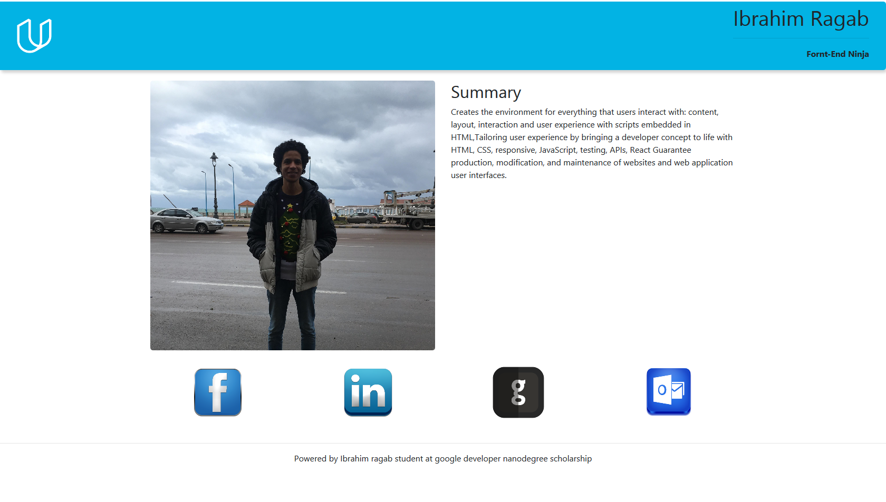
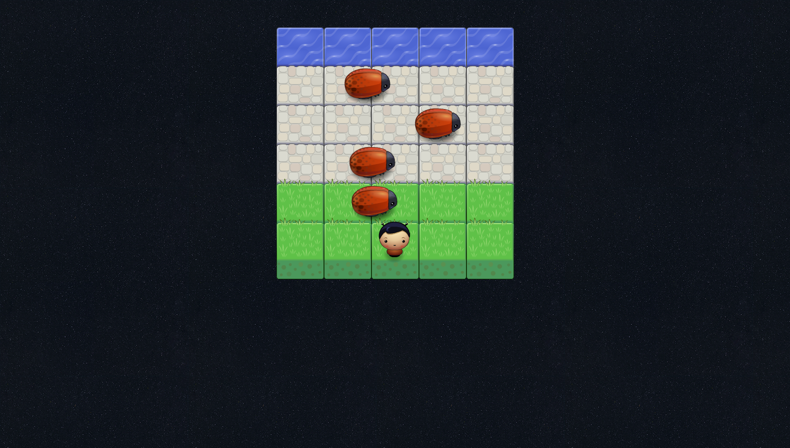
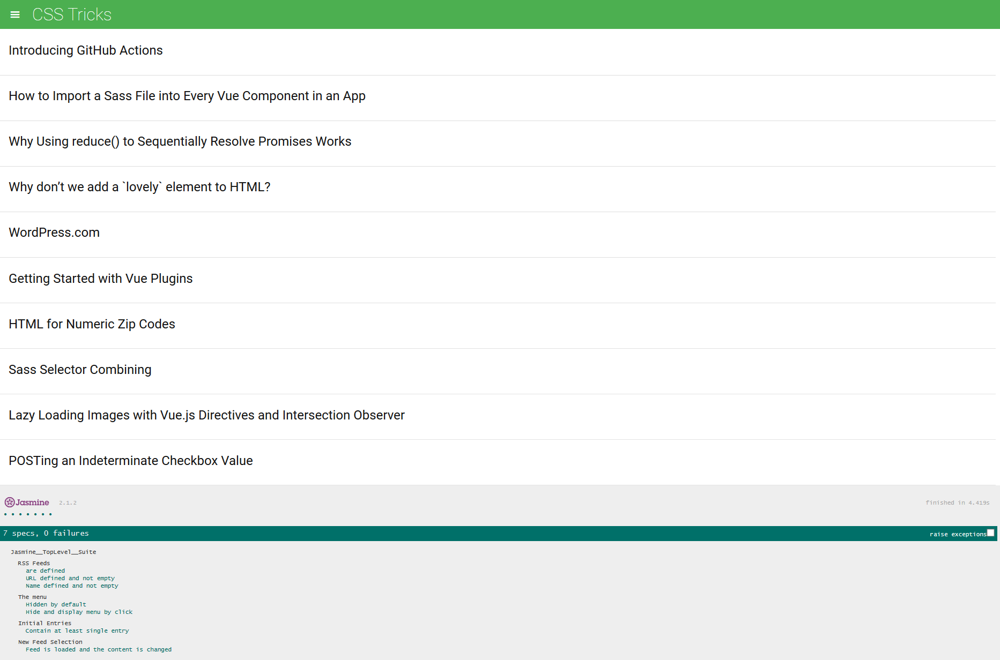

# Udacity-FEND
[](https://github.com/Yuribenjamin/Udacity-FEND/blob/master/LICENSE)

Udacity's Google Developer Challenger Scholarship - Front End Web Development

```
    [+] AUTOR:      Ibrahim Ragab
    [+] EMAIL:      Abrahammoustafa@hotmail.co.uk
    [+] Github:     https://github.com/Yuribenjamin
    [+] twitter:    @AbrahamRagab

```

## Project 1: Animal-trading-cards

First project in Google Developer Scholarship. This Project Passed on HTML, CSS languages. Small Project Describe The Barn Owl, Average Length, Average lifespan, Habitat.

GitHub repository: https://github.com/Yuribenjamin/Animal-trading-cards


## Project 2: Mockup-portfolio

Second Project in Google Developer Scholarship. Small project passed on Html, Css, responsive media queries, compatible with all devices, include bootstrap,The project contain my photo and my facebook, linkedin, github acoount and also my mail, this edition cannot be upgraded, it's for educational purpose, otherwise i will make new and powerful website for work purpose.

GitHub repository: https://github.com/Yuribenjamin/Mockup-portfolio




## Project 3: Memory Game

Memory game is a matching game, containing of 16 cards, the goal is to matching up 8 pairs, you can only open two cards at the same time, if you success the game is over!

GitHub repository: https://github.com/Yuribenjamin/memory-game


## Project 4: Arcade Game

Classic arcade game clone project 4 in Google Developer Scholarship passed on OOJS & Canvas.

GitHub repository: https://github.com/Yuribenjamin/arcade-game




## Project 5: Feed Reader Testing

Feed Reader Testing project 5 in Google Developer Scholarship a web-based application that reads RSS feeds, the project must passing all the required test suites using Jasmine framework.

GitHub repository: https://github.com/Yuribenjamin/feed-reader-testing




## Project 6: Restaurant Reviews

For the Restaurant Reviews projects, incrementally convert a static webpage to a mobile-ready web application. take a static design that lacks accessibility and convert the design to be responsive on different sized displays and accessible for screen reader use. also add a service worker to begin the process of creating a seamless offline experience for your users.

GitHub repository:  https://github.com/Yuribenjamin/restaurant-reviews


