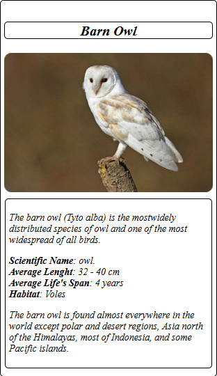

# Udacity-FEND
[](https://github.com/Yuribenjamin/Udacity-FEND/blob/master/LICENSE)

Udacity's Google Developer Challenger Scholarship - Front End Web Development

```
    [+] AUTOR:      Ibrahim Ragab
    [+] EMAIL:      Abrahammoustafa@hotmail.co.uk
    [+] Github:     https://github.com/Yuribenjamin
    [+] twitter:    @AbrahamRagab

```

## Project 1: Animal-trading-cards

First project in Google Developer Scholarship. This Project Passed on HTML, CSS languages. Small Project Describe The Barn Owl, Average Length, Average lifespan, Habitat.

GitHub repository: https://github.com/Yuribenjamin/Animal-trading-cards



<br>

## Project 2: Mockup-portfolio

Second Project in Google Developer Scholarship. Small project passed on Html, Css, responsive media queries, compatible with all devices, include bootstrap,The project contain my photo and my facebook, linkedin, github acoount and also my mail, this edition cannot be upgraded, it's for educational purpose, otherwise i will make new and powerful website for work purpose.


<br>


